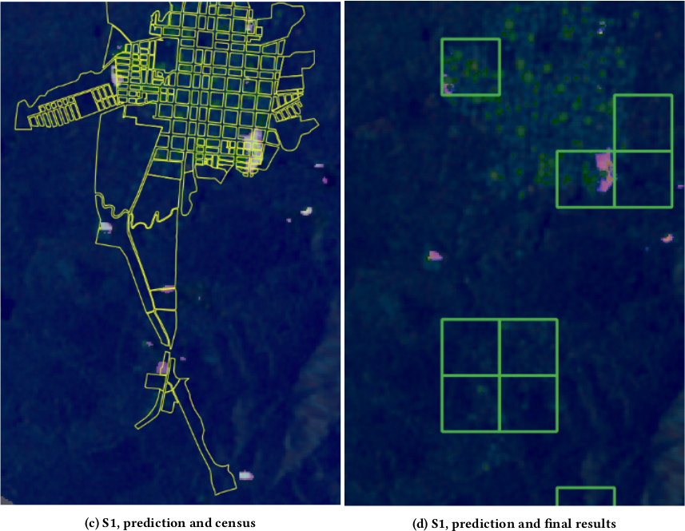

# Detección de asentamientos informales usando imágenes del satélite Sentinel-1

## Requerimientos

Se utilizan las herramientas **GDAL** y [Orfeo Toolbox](https://www.orfeo-toolbox.org/) en la primera etapa del pre-procesamiento de los datos. Luego, se emplean nuestros paquetes [satproc](https://github.com/dymaxionlabs/satproc) y [unetseg](https://github.com/dymaxionlabs/satproc) para la generación del dataset y modelo de ML respectivamente.

## Notebooks

Este repositorio contiene un conjunto de notebooks de Jupyter, que describen los pasos necesarios:

1. [Entrenamiento](notebooks/1_Entrenamiento.ipynb): Se procesan las imágenes satelitales y la verdad de campo para generar el dataset de entrenamiento. Luego se entrena y evalua el modelo. 
2. [Prediccion](notebooks/2_Prediccion.ipynb): Predicción sobre la región de interés y procesamiento de los resultados de la predicción.

## :handshake: Contribuciones

Reportes de bugs y *pull requests* pueden ser reportados en la [página de issues](https://github.com/dymaxionlabs/adefinir) de este repositorio. Este proyecto está destinado a ser un espacio seguro y acogedor para la colaboración, y se espera que los contribuyentes se adhieran al código de conducta [Contributor
Covenant](http://contributor-covenant.org).

## :page_facing_up: Licencia

El código está licenciado bajo Apache 2.0. Refiérase a [LICENSE.txt](LICENSE.txt).
